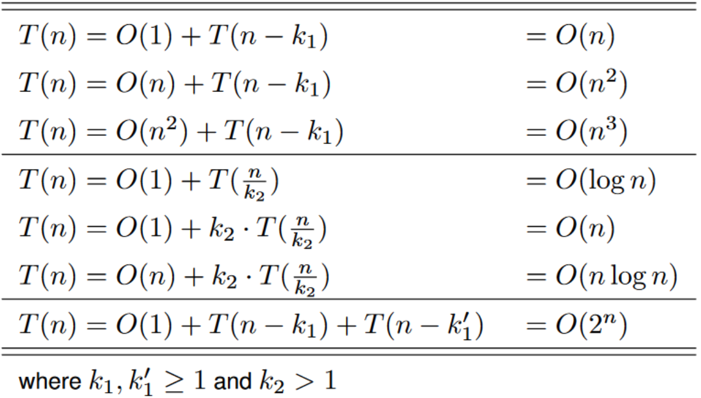

# Big O Notation

A way of measuring how much something scales with time. The definition is, let f(x) be a real-valued function. We define O(f(x)) as the set functions g(x) such that there exists C > 0 and a X such that |g(x)| < C|f(x)| where x >= X for all x.

3n + 5 and 100n + 31 have the same order by their power on n.

## Polynomial Order Theorem
For all x>=1, a polynomial will have a order of O(x^n) where n is the highest power. See proof. Let g0(x) be in O(f0(x)) and g1(x) is in O(f1(x)).

If one has running time of n and another section has running time of n^2. Then our total order is n^2. We are picking the biggest, it's quite intuitive. Similarly, g0(x) + g1(x) = O(|f0(x)| + |f1(x)|). g0(x)g1(x) = O(f0(x)*f1(x))

## Function Growth Rates

We write f << g if and only if f(x) = O(g(x))

Growth rates,for fixed constants c1 and c2, have 1 << log n << n^c1 << c2^n << n! << n^n. There are actually a lot of algorithm complexity functions like little o, big theta, big omega, little omega, etc.

## Examples

### Example 1

```C
void printAllPossibleOrderedPairs(int arr[], int size) {
    for (int i = 0; i < size; i++) {
        for (int j = 0; j < size; j++) {
            printf("%d = %d\n", arr[i], arr[j]);
        }
    }
}
```

printf() is O(1). The nested for loop is O(n), the outer loop is O(n). The total order is O(n^2).

### Example 2

```C
void printStuff(int arr[], int size){
    printf("First element of array = %d\n",arr[0]);

    for (int i = 0; i < size / 2; i++) {
        printf("%d\n", arr[i]);
    }

    for (int i = 0; i < 100; i++){
        printf("Hi\n");
    }
}
```

printf() is O(1). The first print statement is O(1). The first for loop is O(n), because we don't worry about the constant `size/2`. The second for loop is O(1), it only runs 100 times. The total order is still O(n).

### Example 3

```C
int gamma(int n) {
    int s = 0;
    for (int i = 0; i < 1000000; i++)
        for (int j = 0; j < n / 10; j++)
            s++;
}
```

s++ is O(1). The inner nested for loop is n / 10 is O(n) and the outer loop is O(1). The composition is O(n).

### Example 4

```C
int fun2(int n) {
    assert(n>0);
    while (n>=1) {
        printf("%d\n", n);
        n /= 2;
    }
}
```

The function expects positive numbers. The nested printf() is O(1). n/=2 is O(1). The while loop executes n/2/2/2/2/2/2..../2 < 1.

Let's say the number of times we divided is k times. Then n / (2^k) = 1, n = 2^k, k = log2(n). Thus the while loop is O(log2(n)). Now, the total function is O(log2(n)).

### Example 5

```C
int zeta(int a[], int n) {
    int s = 0;
    for (int i = 1; i < n; i *= 2) {
        if (a[i] == 0) return -1;
        else s++;
    }
    return s;
}
```

The same idea. The loop is O(log2(n)) since the number of times the function runs is n/2^k (again!) and the inside of the loop is O(1), the initializations and return statement is O(1). The total is O(log2(n)).

# Recursive Runtime

A. Identify the order of the function, excluding any recursion
B. Determine the size of the data for the next recursive call(s)
C. Write the full recurrence relation
D. Look up the closed-form solution in the table



### Example 1

```C
int fib(int num) {
    if (num <= 1)
        return num;
    return fib(num - 2) + fib(num - 1);
}
```

The (num <= 1) is O(1), T(n) = O(1) + T(n - 1) + T(n - 2), the total order is O(2^n).

### Example 2
```C
int factorial(unsigned int n) {
    if (n == 0)
        return 1;
    else
        return n * factorial(n - 1);
}
```

The factorial recursive is T(n) = O(1) + T(n - 1), thus the function is O(n^2).

### Example 3

T(n) = O(n) + T(n - 1). The rest of the answers are O(1). The final answer is O(n^2).

### Example 4

```C
int cum_fact(int n, int res) {
    if (n <= 1) return res; // O(1)
    else return cum_fact(n-1, res*n);
}

int factorial(int n){
    assert(n>=0); // O(1)
    return cum_fact(n, 1); // O(cum_fact()) = O(n)
}
```

cum_fact() is T(n) = O(1) + T(n - 1). Thus cum_fact is O(n) from the table, the factorial function is O(n).


### Example 5

```C
void hanoi (int n, char src, char dst, char sp) {
    if (n == 1) {
        printf("Move disk 1 from %c to %c\n", src, dst); // O(1)
    } 
    else {
        // Move n - 1 disks from src to sp using dst as a spare.
        hanoi(n - 1, src, sp, dst); // O(n)
        // Move disk n from src to dst
        hanoi(1, src, dst, sp); // O(1)
        // Move n - 1 disks from sp to dst using src as a spare.
        hanoi(n - 1, sp, dst, src); O(n)
    }
}
```

The recursive relation is T(n) = O(1) + 2T(n-1). This is because the second recursive call does not depend on the size of n, the next recursive call is immediately (n==1). From the table, the time complexity of O(2^n).

### Example 6

```C
int main(void) {
    int num;
    printf("Enter a positive integer.\n"); // O(1)
    scanf("%d", &num); // O(1)
    int sum = 0; // O(1)
    do {
        sum += num % 10; // O(1)
        num = num / 10;
    } while (num > 0);
    printf("The sum of digits is: %d\n", sum);
}
```

Notice, for a very large n, the number of steps will be num / 10^k = 0, 10^k > num, k > log10(num). The complexity is O(log10(n)). Also, it's O(n) where n is the number of digits. 

```C
for (int i = 0; i < n; i++)
    for (int j = 0; j <= i; j++)
        ...O(1)
```

Best case scenario? Worst case scenario? Notice, we have 0,1,2,...,n-1, and for j we have 0,1,2,...,n. The number of inner loop executions is sum of natural numbers, or 0.5(n^2 + n) This is worst case O(n^2) time complexity. There is no best case scenario.

__Best-case and worst-case complexities differ only when the algorithm’s behavior depends on the input.__
