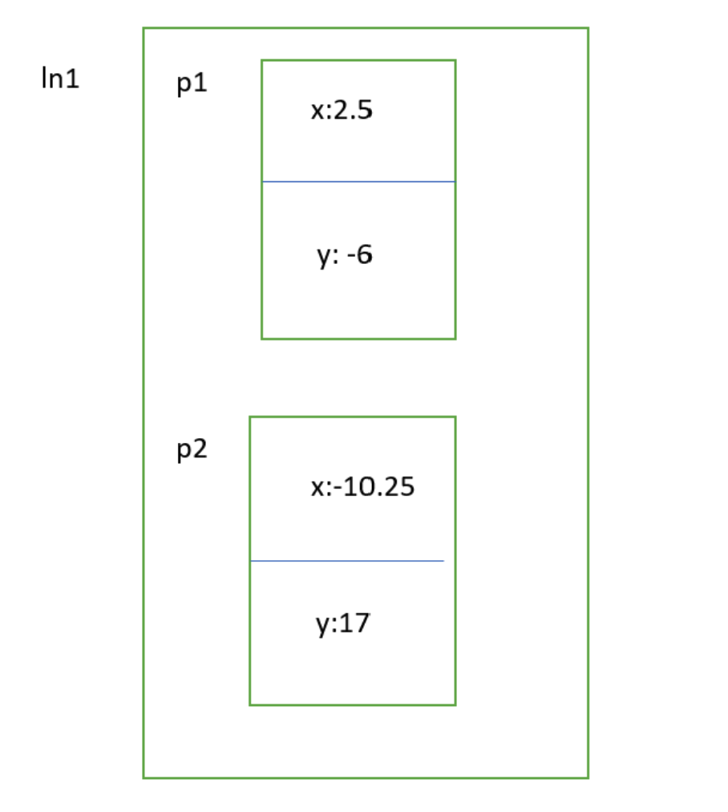

# Structures

Structures are special variables which give us the ability to group variables. They consist of named member variables and are stored together in memory.

## Syntax

We can even return structures in the same way as other variables.

`struct tod todAddTime(struct tod when, int hours, int minutes)`

## Example

```C
#include <stdio.h> 
struct tod {
    int hours;
    int minutes;
};

void todPrint (struct tod when) {
    printf(" %0.2d :%0.2d\n", when.hours, when.minutes);
}

struct tod todAddTime(struct tod when, int hours, int minutes) {
    when.minutes += minutes;
    when.hours += hours + when.minutes / 60; // minute overflow from 60min
    when.minutes %= 60;
    when.hours %= 24;
    return when;
}

int main(void) {
    struct tod now = { 16, 50 };
    struct tod later;
    printf("Now: ");
    todPrint(now);

    // Check the output. Why do we see those numbers?
    // Because later was NOT initialized,
    // thus it has arbitrary values in memory.

    printf("Later: ");
    todPrint(later); 
    
    later = todAddTime(now, 1, 10);
    printf("now: ");
    todPrint(now);

    // When passing structs to functions, these values are also
    // passed-by-value, which mean a copy of the value is
    // passed to the parameter
    printf("updated later: ");
    todPrint(later);
    return 0;
}
```

Assigning a structure to a structure __only__ works when the function returns the structure. If a variable is __not__ initalized it will be garbage.

However, if you initialize one variable, all the rest of the fields will be initialized as zeros in arrays and structures.

## Simplification Using ``typedef``

```C
#include <stdio.h>

typedef struct {
    int hours ;
    int minutes ;
} tod;

int main(void) {
    tod now = {14 ,40}; // instead of struct tod
    return 0;
}
```

# Array of Structures

Structure data can be fed into an array.

```C
# include<stdio.h>

struct student{
    int id;
    int assgn;
    int mid;
    int fexam;
    int fgrade;
};

void calc_fgrade (struct student a[], int n) {
    for (int i = 0; i < n; i++)
        a[i].fgrade = 0.2 * a[i].assgn + 0.3 * a[i].mid + 0.5 * a[i].fexam;
}

int main(void) {
    struct student cs137[5] = {
        {1111, 80, 88, 78}, 
        {2222, 77, 90, 81},
        {3333, 67, 66, 78},
        {4444, 90, 100, 98},
        {5555, 88, 77, 84},
    };

    calc_fgrade(cs137, 5);
    for(int i = 0; i < 5; i++)
        printf("student %d, final - grade =%d\n", cs137[i].id, cs137[i].fgrade);

    return 0;
}
```

Each array is of type student. Everytime we do `a[i]` we have a student, and we access info about each student.

# Structures In Structures

```C
#include <stdio.h>

typedef struct {
    double x;
    double y;
} point;

typedef struct {
    point p1;
    point p2;
} line;


// Finds equation of line by y = mx + b
int main(void) {
    line ln1 = { 
        {2.5, -6}, 
        {-10.25, 17},
    };

    double a, b;
    a = (ln1.p1.y - ln1.p2.y) / (ln1.p1.x - ln1.p2.x);
    b = ln1.p1.y - a * ln1.p1.x;
    printf("y = %fx + %f\n", a, b);

    return 0;
}
```

## The Stack Frame
The inputs are p1 = (2.5, -6) and p2 = (-10.25, 17).



# Structure of Arrays

```C
#include <stdio.h>

typedef struct {
    int id;
    int assgn[10];
    int mid;
    int fexam;
} student;

int main(void) {
    student stud = { 
        11111,
        {80, 90, 88, 99, 77, 78, 76, 89, 90, 100}, 
        88, 
        78
    };
    int fgrade, sum = 0;
    for (int i = 0; i < 10; i++)
        sum += stud.assgn[i];

    fgrade = 0.2 * sum / 10 + 0.3 * stud.mid + 0.5 * stud.fexam;
    printf("student %d, final-grade=%d\n", stud.id, fgrade);
    return 0;
}
```

## Exercise

```C
#include <stdio.h>

typedef struct {
    int x; int y;
} point;

point fun(point p) {
    p.x++; p.y++;
    return p;
}

int main(void) {
    point p1 = {1, 1};
    point p2 = {2, 2};
    p1 = fun(p2);
    printf("%d %d", p1.x, p2.x);
    return 0;
}
```

The output is `3 2`. Since `fun()` returns a function, p1 gets p2.x++ and p2.y++ (which is `3,3`) and the output is `p1.x`, which is 3, and `p2.x`, which is 2.

## Exercise

```C
#include <stdio.h>

typedef struct{
    int x;
    int y;
} point;

int main(void) {
    point arr[2] = {
        {2, 2},
    };

    printf("%d %d", arr[1].x, arr[1].y);
    return 0;
}
```

The `arr[2]` has [0] as {2, 2}, [1] as 0, and arr[2] as zero. We only initalized one. Therefore `arr[1].x` is zero, and `arr[2]` is zero. The outputs is `0 0`.